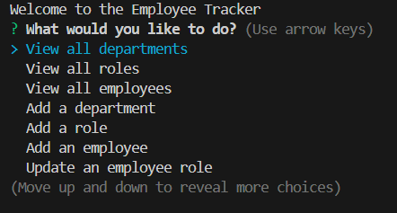
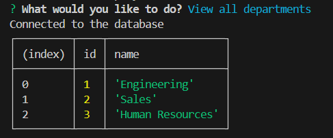

# Employee Tracker SQL



Video example: https://drive.google.com/file/d/1SmEp5qAH-KqhRExDov0HIL3VtOrlo_-l/view

## Description
This is a sql database that stores employee information, including earnings, management level, and names, and allows you to access them using a few queries.

## Table of Contents
- [Description](#description)
- [Installation](#installation)
- [Usage](#usage)
- [Tests](#tests)
- [Questions](#questions)

## Installation
```
First you must install npm inquirer 8.2.4, inquirer pg, and postgreSQL.
```

## Usage
It keeps a database of information that can be easily accessed for quick use.

## Tests
Error messages should be logged into the console 

## Questions
If you have any questions please go to my github:
https://github.com/SleekWingX 